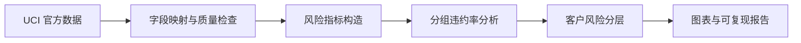

<div align="center">

# 信用卡客户违约风险分析

**从数据质量、还款行为到客户风险分层的可复现分析项目**


基于 UCI `Default of Credit Card Clients` 数据集，分析客户授信、账单、还款与历史逾期行为和下一期违约之间的关系。

[核心发现](#核心发现) · [分析流程](#分析流程) · [项目结构](#项目结构) · [快速复现](#快速复现) · [数据与限制](#数据来源与使用限制)

</div>


## 项目概览

| 样本量 | 总体违约率 | 无历史逾期客户 | 六期均逾期客户 |
|:---:|:---:|:---:|:---:|
| **30,000** | **22.12%** | **11.71%** | **70.32%** |

本项目第一阶段聚焦数据理解、质量检查、探索性分析、风险指标构造与规则式风险分层。所有结论均由代码生成，原始数据不进入仓库，可通过 UCI 官方接口重新获取。

## 核心发现

1. **历史逾期是最清晰的风险信号。** 没有历史逾期的客户违约率为 11.71%，六个月均逾期的客户达到 70.32%。
2. **额度使用率越高，违约率总体越高。** 使用率从 0–25% 上升到 75–100% 时，违约率由 16.65% 上升到 30.74%。
3. **较高还款比例对应较低违约率。** 还款比例为 0–10% 的客户违约率为 26.99%，超过 100% 的客户为 14.47%。
4. **还款行为比账单金额本身更有区分度。** 平均还款金额最低与最高四分位组的违约率分别为 31.16% 和 13.23%，平均账单金额四分位差异则较弱。
5. **不能武断声称连续逾期一定更危险。** 在同样逾期 2 个月的客户中，连续组违约率为 37.31%，零散组为 43.96%；更高逾期次数下零散样本不足，无法进行可靠比较。

<table>
  <tr>
    <td width="50%"></td>
    <td width="50%"></td>
  </tr>
  <tr>
    <td align="center"><b>历史逾期月份</b></td>
    <td align="center"><b>额度使用率</b></td>
  </tr>
  <tr>
    <td width="50%"></td>
    <td width="50%"></td>
  </tr>
  <tr>
    <td align="center"><b>还款比例</b></td>
    <td align="center"><b>规则式风险分层</b></td>
  </tr>
</table>

> 上述结果描述相关关系，不代表因果关系。规则式风险分层用于探索性分析，不是真实授信模型。

## 分析流程



- 将 UCI 接口返回的 `X1…X23` 显式映射为官方业务字段。
- 检查形状、缺失、重复、标签和还款状态编码；35 条完全重复记录因缺少客户唯一标识而只报告、不武断删除。
- 构造平均账单、平均还款、额度使用率、还款比例、逾期月份和最长连续逾期。
- 对非正分母返回缺失值，避免产生无穷或误导性比例。
- 在逾期总次数相同时比较连续与零散逾期，降低混杂影响。

## 项目结构

```text
credit-default-risk-analysis/
├── data/                 # 本地数据；CSV 被 Git 忽略
├── docs/                 # 字段和派生指标数据字典
├── notebooks/            # 数据理解与风险分析 Notebook
├── reports/
│   ├── figures/          # 可复现图表
│   └── analysis_summary.json
├── src/                  # 获取、检查、特征工程与分析代码
├── tests/                # 边界情况和指标逻辑测试
├── README.md
└── requirements.txt
```

| 入口 | 作用 |
|---|---|
| [`notebooks/01_data_understanding.ipynb`](notebooks/01_data_understanding.ipynb) | 数据结构与质量检查 |
| [`notebooks/02_risk_analysis.ipynb`](notebooks/02_risk_analysis.ipynb) | 风险指标与业务分析 |
| [`src/feature_engineering.py`](src/feature_engineering.py) | 可测试的风险特征构造 |
| [`reports/analysis_summary.json`](reports/analysis_summary.json) | 完整数值结果 |
| [`docs/data_dictionary.md`](docs/data_dictionary.md) | 字段含义与边界处理 |

## 快速复现

```powershell
D:\python\python.exe -m venv .venv
.\.venv\Scripts\Activate.ps1
python -m pip install --upgrade pip
python -m pip install -r requirements.txt
python -m src.fetch_data
python -m src.analysis
python -m pytest -q
```

预期结果：获取 30,000 条数据，生成分析摘要与图表，并通过 3 个测试。

## 数据来源与使用限制

- 数据集：[UCI Default of Credit Card Clients](https://archive.ics.uci.edu/dataset/350/default+of+credit+card+clients)
- DOI：[10.24432/C55S3H](https://doi.org/10.24432/C55S3H)
- 许可：[CC BY 4.0](https://creativecommons.org/licenses/by/4.0/)
- 数据反映特定地区和历史时期，不能直接外推到当前中国大陆信用市场。
- 性别、婚姻状况等字段不应被简单解释为授信依据。
- 项目仅用于学习和作品展示，不用于真实个人的自动化信贷决策。

## 下一阶段

- 建立逻辑回归基准模型，并与决策树、随机森林比较。
- 使用交叉验证、ROC-AUC、PR-AUC、Recall 和 F1，避免只看 Accuracy。
- 分析不同决策阈值下漏判违约客户与误拒正常客户的业务成本。
- 检查敏感属性相关的群体差异与潜在偏差。
