<div align="center">

# 信用卡客户违约风险分析

**从数据质量、还款行为到客户风险分层的可复现分析项目**


基于UCI `Default of Credit Card Clients`数据集，分析客户授信、账单、还款与历史逾期行为和下一期违约之间的关系。

[核心发现](#核心发现) · [分析流程](#分析流程) · [项目结构](#项目结构) · [快速复现](#快速复现) · [数据与限制](#数据来源与使用限制)

</div>

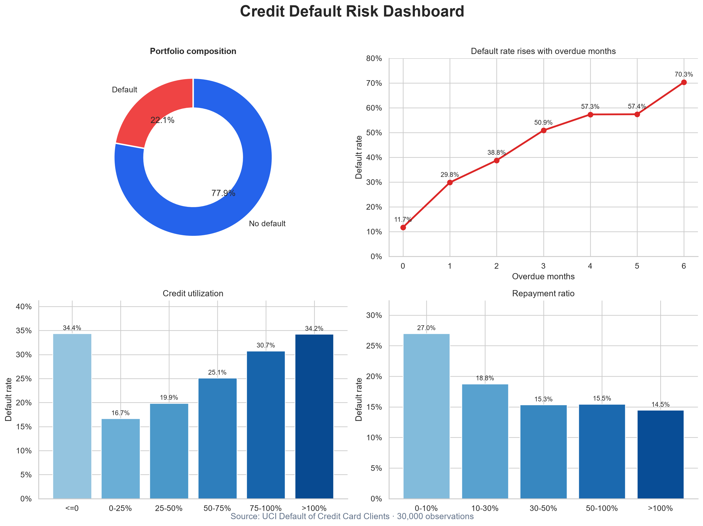

## 项目概览

| 样本量 | 总体违约率 | 高风险客户占比 | 高风险组捕获违约占比 |
|:---:|:---:|:---:|:---:|
| **30,000** | **22.12%** | **12.48%** | **33.85%** |

本项目第一阶段聚焦数据理解、质量检查、探索性分析、风险指标构造与规则式风险分层；第二轮分析进一步验证分层的风险捕获能力，寻找近期预警信号，并分离授信额度与额度使用率的影响。所有结论均由代码生成，原始数据不进入仓库，可通过 UCI 官方接口重新获取。

## 核心发现

1. **规则分层确实浓缩了风险。** 高风险组仅占 12.48% 的客户，却包含 33.85% 的全部违约事件；其组内违约率为 59.99%，是总体水平的 2.71 倍。中、高风险组合计占 33.56% 的客户，覆盖 64.83% 的违约事件。
2. **最近两期连续出现逾期，是可执行的预警信号。** 最近两期均未逾期的客户违约率为 13.36%，仅一期逾期时约为 38%–40%，两期均逾期时达到 57.78%。这支持按信号强度安排提醒、人工关怀和账户复核优先级。
3. **额度使用率在相同授信层级内仍有区分度。** 在 20万–50万额度组中，使用率 25%–50% 的违约率为 9.62%，75%–100% 时升至 24.87%；这说明总体关系不只是“低额度客户本来就更危险”。
4. **历史逾期仍是最清晰的累计风险信号。** 没有历史逾期的客户违约率为 11.71%，六个月均逾期的客户达到 70.32%。
5. **还款行为比账单金额本身更有区分度。** 平均还款金额最低与最高四分位组的违约率分别为 31.16% 和 13.23%，平均账单金额四分位差异则较弱。

## 第二轮业务洞察

### 1. 风险分层能抓住多少违约客户？

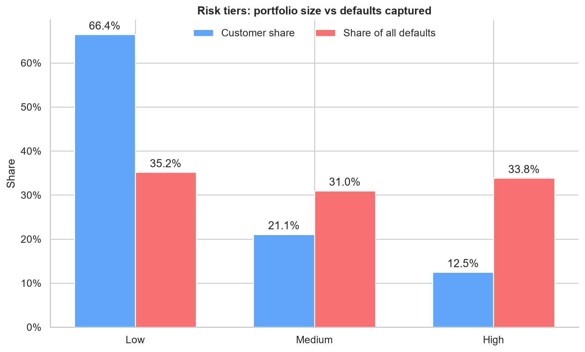

高风险组的“违约占比”明显高于“客户占比”，说明规则分层具有风险浓缩作用。实际业务中，可以先把资源放在中、高风险客户，但不能忽视低风险组：因为低风险客户基数大，仍贡献了 35.17% 的违约事件。

### 2. 哪些信号适合做近期预警？

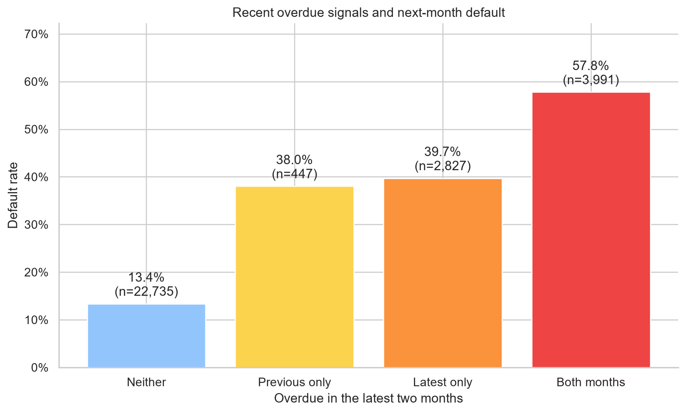

最近两期均逾期的客户可作为最高优先级观察对象；只有最近一期逾期的客户违约率也达到 39.72%，适合及时触发提醒。这里的“预警”表示风险排序依据，不代表一定会违约。

### 3. 是低额度危险，还是额度用得太满危险？

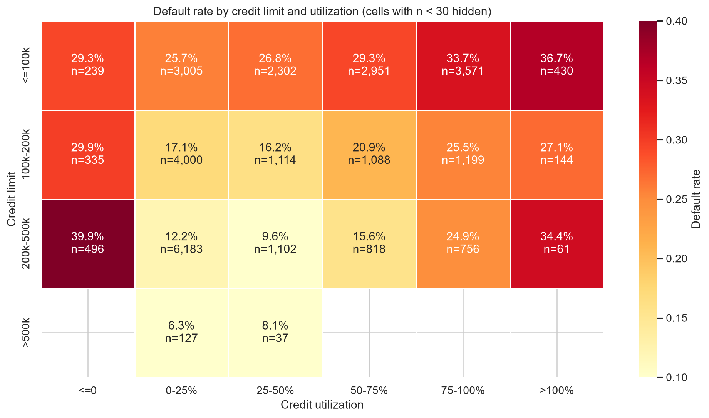

矩阵同时控制授信额度区间和额度使用率区间。多个额度层级中都能看到使用率升高时风险上升，因此额度使用率提供了额外信息。图中同时展示样本量，并隐藏少于 30 人的格子，避免用极小样本得出夸张结论。

### 可执行建议

- 对最近两期均逾期的客户设置最高观察优先级；单期新出现逾期也应及时提醒。
- 对中、高风险客户结合额度使用率进行二次排序，而不是只凭授信额度判断。
- 为低风险大客群保留轻量监控，因为该群体仍包含约三分之一的全部违约事件。
- 后续建模时用样本外验证检验这些规则，比较“覆盖更多违约”与“误伤正常客户”的成本。

<table>
  <tr>
    <td width="50%">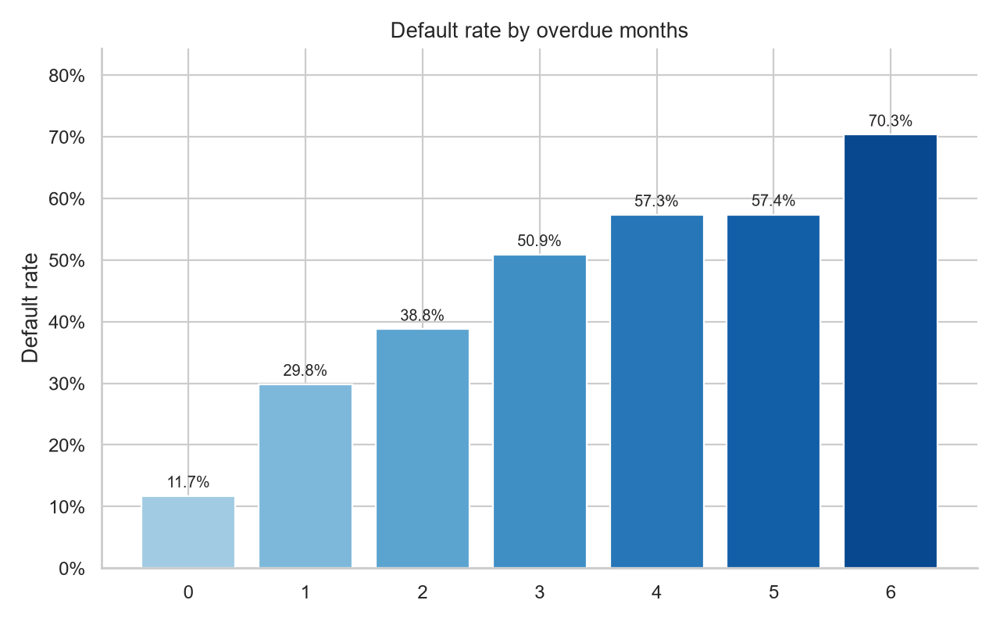</td>
    <td width="50%">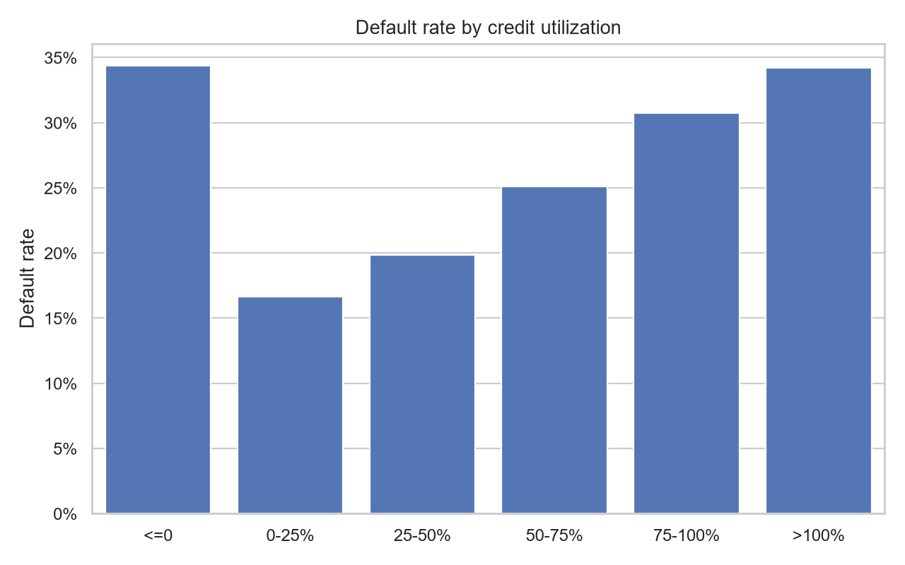</td>
  </tr>
  <tr>
    <td align="center"><b>历史逾期月份</b></td>
    <td align="center"><b>额度使用率</b></td>
  </tr>
  <tr>
    <td width="50%">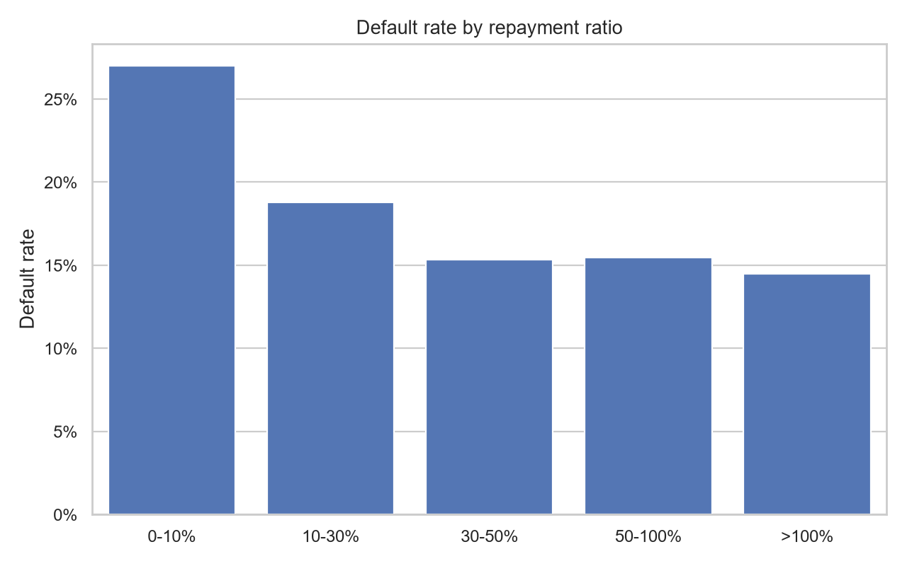</td>
    <td width="50%">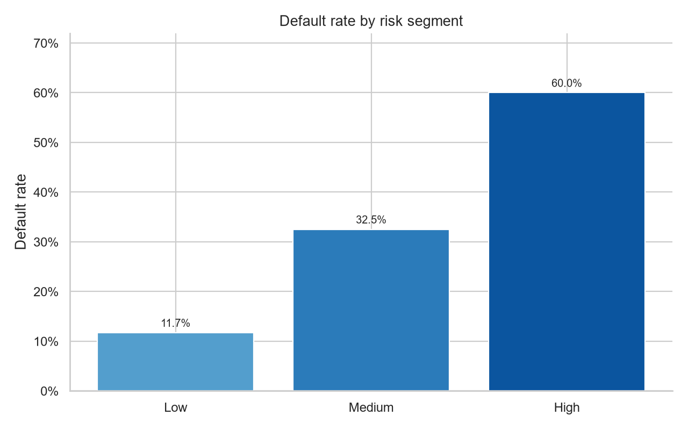</td>
  </tr>
  <tr>
    <td align="center"><b>还款比例</b></td>
    <td align="center"><b>规则式风险分层</b></td>
  </tr>
</table>

> 上述结果描述相关关系，不代表因果关系。规则式风险分层用于探索性分析，不是真实授信模型。

## 分析流程

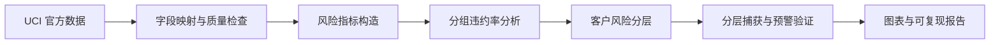

- 将 UCI 接口返回的 `X1…X23` 显式映射为官方业务字段。
- 检查形状、缺失、重复、标签和还款状态编码；35 条完全重复记录因缺少客户唯一标识而只报告、不武断删除。
- 构造平均账单、平均还款、额度使用率、还款比例、逾期月份和最长连续逾期。
- 对非正分母返回缺失值，避免产生无穷或误导性比例。
- 在逾期总次数相同时比较连续与零散逾期，降低混杂影响。

## 项目结构

```text
credit-default-risk-analysis/
├── data/                 # 本地数据；CSV 被 Git 忽略
├── docs/                 # 字段和派生指标数据字典
├── notebooks/            # 数据理解与风险分析 Notebook
├── reports/
│   ├── figures/          # 可复现图表
│   └── analysis_summary.json
├── src/                  # 获取、检查、特征工程与分析代码
├── tests/                # 边界情况和指标逻辑测试
├── README.md
└── requirements.txt
```

| 入口 | 作用 |
|---|---|
| [`notebooks/01_data_understanding.ipynb`](notebooks/01_data_understanding.ipynb) | 数据结构与质量检查 |
| [`notebooks/02_risk_analysis.ipynb`](notebooks/02_risk_analysis.ipynb) | 风险指标与业务分析 |
| [`src/analysis.py`](src/analysis.py) | 第二轮分层效果、近期预警与风险矩阵分析 |
| [`src/modeling.py`](src/modeling.py) | 第二阶段机器学习建模、指标评估与图表生成 |
| [`src/feature_engineering.py`](src/feature_engineering.py) | 可测试的风险特征构造 |
| [`reports/analysis_summary.json`](reports/analysis_summary.json) | 完整数值结果 |
| [`reports/modeling_report.md`](reports/modeling_report.md) | 建模结果、业务解释与限制说明 |
| [`reports/modeling_summary.json`](reports/modeling_summary.json) | 可复现的机器学习指标摘要 |
| [`docs/data_dictionary.md`](docs/data_dictionary.md) | 字段含义与边界处理 |

## 快速复现

```powershell
D:\python\python.exe -m venv .venv
.\.venv\Scripts\Activate.ps1
python -m pip install --upgrade pip
python -m pip install -r requirements.txt
python -m src.fetch_data
python -m src.analysis
python -m src.modeling
python -m pytest -q
```

预期结果：获取 30,000 条数据，生成分析/建模摘要与图表，并通过 8 个测试。

## 数据来源与使用限制

- 数据集：[UCI Default of Credit Card Clients](https://archive.ics.uci.edu/dataset/350/default+of+credit+card+clients)
- DOI：[10.24432/C55S3H](https://doi.org/10.24432/C55S3H)
- 许可：[CC BY 4.0](https://creativecommons.org/licenses/by/4.0/)
- 数据反映特定地区和历史时期，不能直接外推到当前中国大陆信用市场。
- 性别、婚姻状况等字段不应被简单解释为授信依据。
- 项目仅用于学习和作品展示，不用于真实个人的自动化信贷决策。

## 第二阶段：机器学习建模

第一阶段解决“哪些客户群体风险更高”，第二阶段进一步建立预测模型，尝试根据客户历史账单、还款和逾期行为识别下个月违约风险。

本阶段比较了三个模型：

- `Dummy baseline`：只作为最低基线，用来提醒我们不能只看 Accuracy。
- `Logistic Regression`：可解释的线性基线模型。
- `Random Forest`：捕捉非线性关系的树模型。

| 模型 | ROC-AUC | PR-AUC | Accuracy | Precision | Recall | F1 |
|---|---:|---:|---:|---:|---:|---:|
| Dummy baseline | 0.500 | 0.221 | 0.779 | 0.000 | 0.000 | 0.000 |
| Logistic Regression | 0.745 | 0.490 | 0.747 | 0.446 | 0.592 | 0.509 |
| Random Forest | 0.776 | 0.556 | 0.775 | 0.493 | 0.595 | 0.539 |

当前最佳模型按 PR-AUC 选择，为 `Random Forest`。在测试集中，如果只审核预测风险最高的 20% 客户，可以覆盖约 **51.09%** 的实际违约客户，审核组违约率为 **56.50%**，约为总体测试集违约率的 **2.55 倍**。

<table>
  <tr>
    <td width="50%">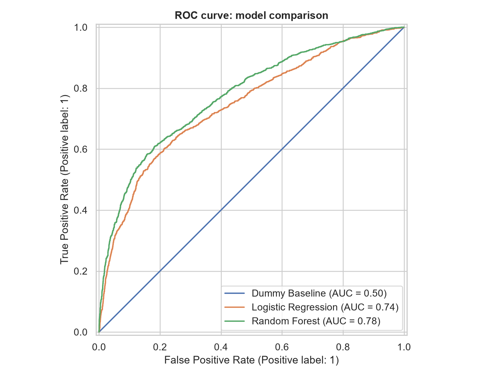</td>
    <td width="50%">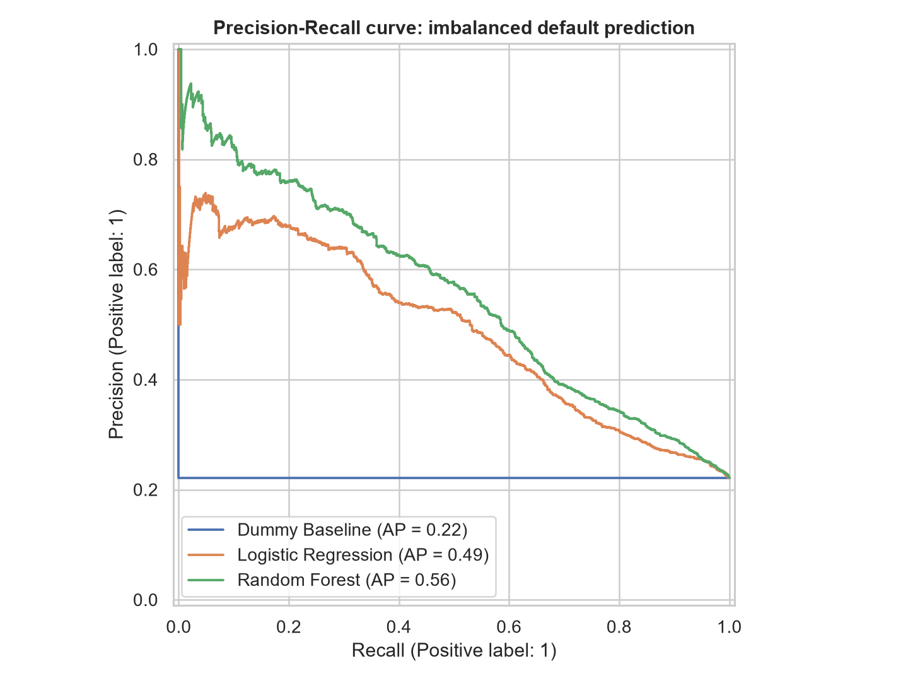</td>
  </tr>
  <tr>
    <td align="center"><b>ROC-AUC：模型排序能力</b></td>
    <td align="center"><b>PR-AUC：类别不均衡下更有参考价值</b></td>
  </tr>
  <tr>
    <td width="50%">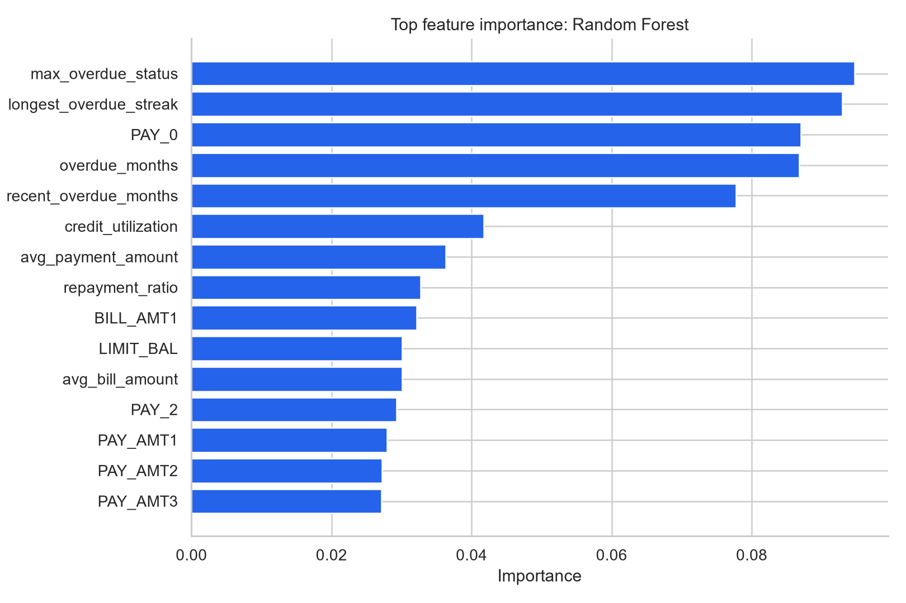</td>
    <td width="50%">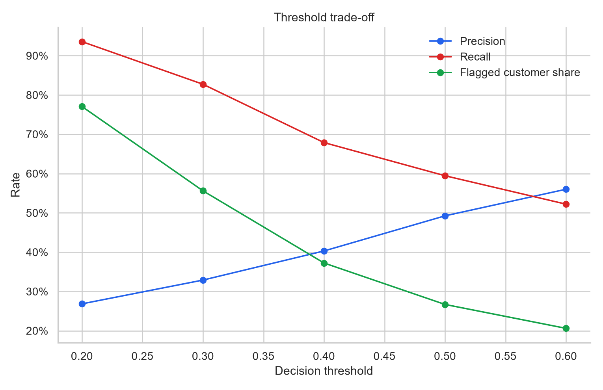</td>
  </tr>
  <tr>
    <td align="center"><b>重要特征集中在逾期与还款行为</b></td>
    <td align="center"><b>阈值越低，召回更高但误报更多</b></td>
  </tr>
</table>

完整建模说明见 [`reports/modeling_report.md`](reports/modeling_report.md)，机器学习结果见 [`reports/modeling_summary.json`](reports/modeling_summary.json)。

> 模型输出的是相关性预测分数，不代表因果关系；当前版本用于学习与作品展示，不用于真实授信、拒绝客户或自动化金融决策。

## 下一阶段

- 使用交叉验证和调参进一步验证模型稳定性。
- 加入成本矩阵，分析不同阈值下漏判违约客户与误伤正常客户的业务代价。
- 使用 permutation importance 或 SHAP 提升模型解释质量。
- 检查敏感属性相关的群体差异与潜在偏差。
