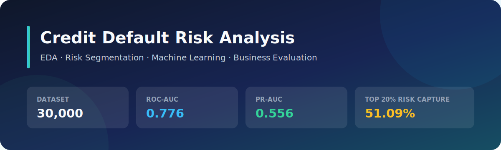
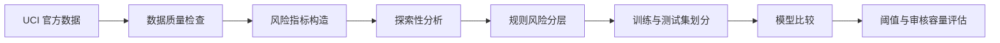

<div align="center">



# 信用卡客户违约风险分析

**从数据质量、探索性分析和风险分层，到机器学习预测的可复现项目**

[](https://www.python.org/)
[](https://github.com/zzhhmm26/credit-default-risk-analysis/actions/workflows/tests.yml)

[](https://creativecommons.org/licenses/by/4.0/)

[项目摘要](#项目摘要) · [第一阶段：数据分析](#第一阶段数据分析) · [第二阶段：机器学习](#第二阶段机器学习) · [技术路线](#技术路线) · [快速复现](#快速复现)

</div>

## 项目摘要

基于 UCI 的 30,000 名信用卡客户数据，本项目先通过数据质量检查、特征工程和探索性分析理解违约风险，再在这些分析基础上建立机器学习模型，预测客户下一期违约风险。

| 数据规模 | 总体违约率 | 规则高风险组违约率 | 最佳 ROC-AUC | 风险前 20% 捕获违约 |
|:---:|:---:|:---:|:---:|:---:|
| **30,000** | **22.12%** | **59.99%** | **0.776** | **51.09%** |

> 阅读顺序：先看数据和业务规律，再看机器学习如何利用这些规律进行风险排序。所有结果均由代码生成，原始数据不进入仓库。

## 第一阶段：数据分析

### 1. 数据理解与质量检查

第一阶段首先回答：数据是否可靠、字段代表什么、哪些客户行为与下一期违约有关？

- 通过 UCI 官方接口获取数据，并将 `X1…X23` 映射为清晰的业务字段。
- 检查数据形状、缺失值、重复记录、字段类型、标签分布和异常还款状态编码。
- 发现 35 条完全重复记录；由于数据缺少可靠的客户唯一标识，只报告而不武断删除。
- 原始数据和处理后 CSV 均由 `.gitignore` 排除，不上传 GitHub。

字段定义和编码规则见 [数据字典](docs/data_dictionary.md)，完整数据检查过程见 [数据理解 Notebook](notebooks/01_data_understanding.ipynb)。

### 2. 风险指标构造

在保留原字段含义的基础上，构造更容易解释客户行为的指标：

| 派生指标 | 业务含义 | 边界处理 |
|---|---|---|
| 额度使用率 | 平均账单金额占授信额度的比例 | 授信额度非正时返回缺失值 |
| 还款比例 | 平均还款金额占平均账单金额的比例 | 账单金额非正时返回缺失值 |
| 历史逾期月份 | 六个月中出现逾期的月份数量 | 每位客户按行统计 |
| 最长连续逾期 | 连续发生逾期的最长月份数 | 区分连续逾期与零散逾期 |
| 最近逾期月份 | 最近两期出现逾期的次数 | 用于近期风险预警 |

特征构造代码位于 [feature_engineering.py](src/feature_engineering.py)，并用测试覆盖零分母、异常编码和极端值。

### 3. 探索性分析结果


#### 历史逾期是最清晰的风险信号

没有历史逾期的客户违约率为 **11.71%**，六个月均逾期的客户违约率达到 **70.32%**。最近两期均逾期的客户违约率为 **57.78%**，而最近两期均未逾期的客户为 **13.36%**。


#### 额度使用率提供了授信额度之外的信息

在 20万–50万授信额度组中，额度使用率 25%–50% 的客户违约率为 **9.62%**，额度使用率 75%–100% 时升至 **24.87%**。这说明风险差异不能简单归结为“低额度客户更危险”。


#### 还款行为比账单金额本身更有区分度

平均还款金额最低与最高四分位组的违约率分别为 **31.16%** 和 **13.23%**；相比之下，平均账单金额各组的差异较弱。金额大不一定意味着风险高，是否持续还款更值得关注。

### 4. 规则式客户风险分层

根据历史逾期、连续逾期和还款行为建立低、中、高风险分层。高风险组只占全部客户的 **12.48%**，却包含 **33.85%** 的违约事件；其组内违约率为 **59.99%**，是总体水平的 **2.71 倍**。中、高风险组合计覆盖 **64.83%** 的违约事件。


这一分层用于探索和安排观察优先级，不是真实授信模型。低风险客户基数较大，仍包含一部分违约事件，因此不能简单忽略。

完整数据分析见 [风险分析 Notebook](notebooks/02_risk_analysis.ipynb) 和 [分析摘要](reports/analysis_summary.json)。

## 第二阶段：机器学习

第一阶段说明了哪些行为与违约风险相关；第二阶段在此基础上回答：能否根据客户历史行为，对下一期违约风险进行更细致的排序？

### 1. 建模设计

- 使用分层抽样划分 80% 训练集和 20% 测试集，保持两组违约率接近。
- 对比最低基线、可解释线性模型和非线性树模型。
- 第一版模型主动排除性别、教育和婚姻状况，降低敏感属性被直接用于风险判断的风险。
- 不只看 Accuracy，同时比较 ROC-AUC、PR-AUC、Precision、Recall、F1 和混淆矩阵。

### 2. 模型对比

| 模型 | ROC-AUC | PR-AUC | Precision | Recall | F1 |
|---|---:|---:|---:|---:|---:|
| Dummy baseline | 0.500 | 0.221 | 0.000 | 0.000 | 0.000 |
| Logistic Regression | 0.745 | 0.490 | 0.446 | 0.592 | 0.509 |
| **Random Forest** | **0.776** | **0.556** | **0.493** | **0.595** | **0.539** |

Random Forest 按 PR-AUC 表现最佳。Dummy baseline 虽然 Accuracy 可达到 77.9%，却识别不出任何违约客户，说明类别不均衡时不能只看准确率。

<table>
  <tr>
    <td width="50%"></td>
    <td width="50%"></td>
  </tr>
  <tr>
    <td align="center"><b>ROC：整体风险排序能力</b></td>
    <td align="center"><b>PR：类别不均衡下的识别能力</b></td>
  </tr>
</table>

### 3. 模型的业务解释

如果只审核测试集中预测风险最高的 **20%** 客户，可以覆盖 **51.09%** 的实际违约客户；该审核组违约率为 **56.50%**，是测试集总体水平的 **2.55 倍**。

<table>
  <tr>
    <td width="50%"></td>
    <td width="50%"></td>
  </tr>
  <tr>
    <td align="center"><b>重要特征主要来自逾期和还款行为</b></td>
    <td align="center"><b>降低阈值会提高召回率，也会增加误报</b></td>
  </tr>
</table>

完整结果见 [建模报告](reports/modeling_report.md) 和 [机器学习摘要](reports/modeling_summary.json)。模型输出是风险排序分数，不代表因果关系，也不用于真实授信或自动化金融决策。

## 技术路线



## 项目结构

```text
credit-default-risk-analysis/
├── data/                  # 本地数据目录；CSV 被 Git 忽略
├── docs/                  # 数据字典与项目素材
├── notebooks/             # 数据理解与风险分析 Notebook
├── reports/
│   ├── figures/           # 由代码生成的分析和建模图表
│   ├── analysis_summary.json
│   └── modeling_report.md
├── src/                   # 数据获取、清洗、特征工程、分析与建模
├── tests/                 # 特征边界与建模逻辑测试
├── README.md
└── requirements.txt
```

## 快速复现

在 Windows PowerShell 中运行：

```powershell
python -m venv .venv
.\.venv\Scripts\Activate.ps1
python -m pip install --upgrade pip
python -m pip install -r requirements.txt
python -m src.fetch_data
python -m src.analysis
python -m src.modeling
python -m pytest -q
```

预期结果：获取 30,000 条数据，依次生成数据分析结果、机器学习结果与图表，并通过 8 个测试。GitHub Actions 会在每次提交和 Pull Request 时自动运行测试。

## 数据来源与使用限制

- 数据集：[UCI Default of Credit Card Clients](https://archive.ics.uci.edu/dataset/350/default+of+credit+card+clients)
- DOI：[10.24432/C55S3H](https://doi.org/10.24432/C55S3H)
- 数据许可：[CC BY 4.0](https://creativecommons.org/licenses/by/4.0/)
- 数据反映特定地区和历史时期，不能直接外推到当前中国大陆信用市场。
- 数据分析描述相关关系，不代表因果关系。
- 规则分层和机器学习模型仅用于学习与作品展示，不用于真实个人的自动化信贷决策。

## 下一步

- 使用交叉验证和调参检验模型稳定性。
- 引入漏判与误判成本，选择更符合业务目标的决策阈值。
- 使用 permutation importance 或 SHAP 提高模型解释质量。
- 检查不同群体的模型表现与潜在偏差。
