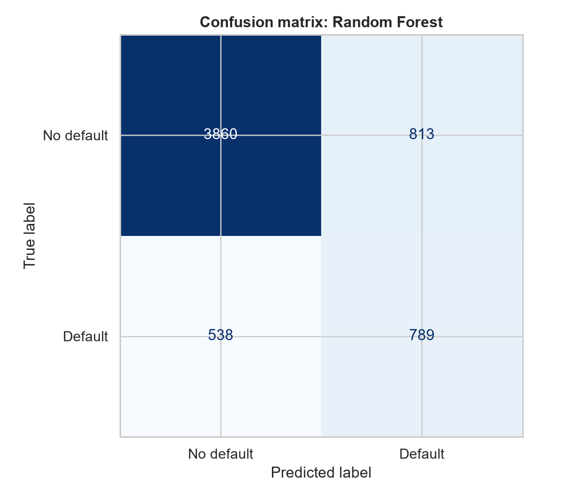
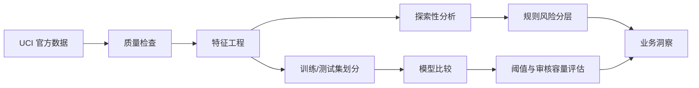

<div align="center">


# 信用卡客户违约风险分析

**从探索性分析、风险分层到机器学习预测的可复现风控项目**

[](https://www.python.org/)
[](https://github.com/zzhhmm26/credit-default-risk-analysis/actions/workflows/tests.yml)

[](https://creativecommons.org/licenses/by/4.0/)

[项目成果](#项目成果) · [业务洞察](#业务洞察) · [机器学习](#机器学习建模) · [技术路线](#技术路线) · [快速复现](#快速复现)

</div>

## 项目成果

> 基于 30,000 名信用卡客户的历史账单、还款与逾期行为，识别下一期违约风险，并将分析结论转化为可执行的客户审核优先级。

| 数据规模 | 总体违约率 | 最佳 ROC-AUC | 最佳 PR-AUC | 高风险前 20% 捕获违约 |
|:---:|:---:|:---:|:---:|:---:|
| **30,000** | **22.12%** | **0.776** | **0.556** | **51.09%** |

项目完成了完整的数据分析与机器学习流程：数据质量检查、特征工程、探索性分析、规则风险分层、模型比较、阈值分析和业务容量评估。所有结果均由代码生成；原始数据不进入仓库，可通过 UCI 官方接口重新获取。

<table>
  <tr>
    <td width="50%"></td>
    <td width="50%"></td>
  </tr>
  <tr>
    <td align="center"><b>业务分析：逾期、额度使用与还款行为</b></td>
    <td align="center"><b>模型评估：类别不均衡下的预测表现</b></td>
  </tr>
</table>

## 业务问题

信用卡违约识别并不只是追求一个高准确率，而要回答三个更实际的问题：

1. 哪些历史行为最能区分未来违约风险？
2. 当人工审核资源有限时，应该优先关注哪些客户？
3. 提高违约召回率的同时，会增加多少正常客户误报？

本项目因此同时报告统计关系、风险排序能力和不同审核容量下的违约覆盖率，不把单一 Accuracy 当作最终结论。

## 业务洞察

### 1. 逾期行为是最清晰的预警信号

没有历史逾期的客户违约率为 **11.71%**，六个月均逾期时达到 **70.32%**。最近两期均逾期的客户违约率为 **57.78%**，明显高于两期均未逾期客户的 **13.36%**。


### 2. 额度使用率提供了授信额度之外的信息

在 20万–50万授信额度组中，额度使用率 25%–50% 的客户违约率为 **9.62%**，使用率 75%–100% 时升至 **24.87%**。这说明风险差异不能简单归结为“低额度客户更危险”。图中隐藏少于 30 人的格子，避免用极小样本得出夸张结论。


### 3. 规则分层能够浓缩风险

规则高风险组只占全部客户的 **12.48%**，却包含 **33.85%** 的违约事件；组内违约率为 **59.99%**，是总体水平的 **2.71 倍**。中、高风险组合计覆盖 **64.83%** 的违约事件。


## 机器学习建模

使用分层抽样将数据划分为 80% 训练集和 20% 测试集，对比最低基线、可解释线性模型和非线性树模型。第一版模型主动排除性别、教育和婚姻状况，降低敏感属性被直接用于风险判断的风险。

| 模型 | ROC-AUC | PR-AUC | Precision | Recall | F1 |
|---|---:|---:|---:|---:|---:|
| Dummy baseline | 0.500 | 0.221 | 0.000 | 0.000 | 0.000 |
| Logistic Regression | 0.745 | 0.490 | 0.446 | 0.592 | 0.509 |
| **Random Forest** | **0.776** | **0.556** | **0.493** | **0.595** | **0.539** |

Random Forest 按 PR-AUC 表现最佳。如果只审核预测风险最高的 **20%** 客户，可以覆盖 **51.09%** 的实际违约客户；该审核组违约率为 **56.50%**，是测试集总体违约率的 **2.55 倍**。

<table>
  <tr>
    <td width="50%"></td>
    <td width="50%"></td>
  </tr>
  <tr>
    <td align="center"><b>ROC 曲线：模型整体排序能力</b></td>
    <td align="center"><b>重要特征：逾期状态与还款行为占主导</b></td>
  </tr>
  <tr>
    <td width="50%"></td>
    <td width="50%"></td>
  </tr>
  <tr>
    <td align="center"><b>混淆矩阵：正确识别与误判数量</b></td>
    <td align="center"><b>阈值取舍：召回更多违约会增加误报</b></td>
  </tr>
</table>

完整解释见 [建模报告](reports/modeling_report.md)，机器可读结果见 [建模摘要](reports/modeling_summary.json)。

## 技术路线



| 环节 | 关键做法 |
|---|---|
| 数据质量 | 检查缺失、重复、字段类型、标签分布和异常状态编码 |
| 特征工程 | 构造额度使用率、还款比例、逾期月份、最长连续逾期等指标 |
| 边界处理 | 非正分母返回缺失值，极端比例不隐式截断 |
| 模型评估 | 同时使用 ROC-AUC、PR-AUC、Precision、Recall、F1 和混淆矩阵 |
| 业务评估 | 计算风险最高前 10%/20%/30% 客户的违约覆盖率与风险提升倍数 |
| 安全边界 | 排除敏感属性；模型仅用于学习展示，不用于真实授信决策 |

## 项目结构

```text
credit-default-risk-analysis/
├── data/                  # 本地数据目录；CSV 被 Git 忽略
├── docs/                  # 数据字典与项目素材
├── notebooks/             # 数据理解与风险分析 Notebook
├── reports/
│   ├── figures/           # 由代码生成的分析图表
│   ├── analysis_summary.json
│   └── modeling_report.md
├── src/                   # 数据获取、清洗、特征工程、分析与建模
├── tests/                 # 特征边界与建模逻辑测试
├── README.md
└── requirements.txt
```

| 入口 | 作用 |
|---|---|
| [数据理解 Notebook](notebooks/01_data_understanding.ipynb) | 数据结构与质量检查 |
| [风险分析 Notebook](notebooks/02_risk_analysis.ipynb) | 风险指标与业务探索 |
| [分析程序](src/analysis.py) | 分层效果、近期预警与风险矩阵 |
| [建模程序](src/modeling.py) | 模型训练、评估和图表生成 |
| [特征工程](src/feature_engineering.py) | 可测试、无隐式修改的派生指标 |
| [数据字典](docs/data_dictionary.md) | 原始字段、编码和指标口径 |

## 快速复现

在 Windows PowerShell 中运行：

```powershell
python -m venv .venv
.\.venv\Scripts\Activate.ps1
python -m pip install --upgrade pip
python -m pip install -r requirements.txt
python -m src.fetch_data
python -m src.analysis
python -m src.modeling
python -m pytest -q
```

预期结果：获取 30,000 条数据，生成分析与建模摘要、图表，并通过 8 个测试。GitHub Actions 也会在每次提交和 Pull Request 时自动运行测试。

## 数据来源与使用限制

- 数据集：[UCI Default of Credit Card Clients](https://archive.ics.uci.edu/dataset/350/default+of+credit+card+clients)
- DOI：[10.24432/C55S3H](https://doi.org/10.24432/C55S3H)
- 数据许可：[CC BY 4.0](https://creativecommons.org/licenses/by/4.0/)
- 数据反映特定地区和历史时期，不能直接外推到当前中国大陆信用市场。
- 分析结果描述相关关系，不代表因果关系。
- 模型输出是风险排序分数，不用于真实授信、拒绝客户或自动化金融决策。

## 下一步

- 使用交叉验证和调参检验模型稳定性。
- 引入漏判与误判成本，选择更符合业务目标的决策阈值。
- 使用 permutation importance 或 SHAP 提高模型解释质量。
- 检查不同群体的模型表现与潜在偏差。
